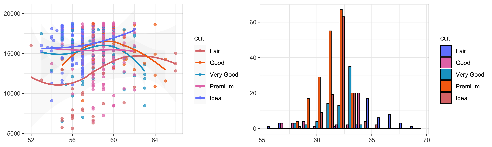
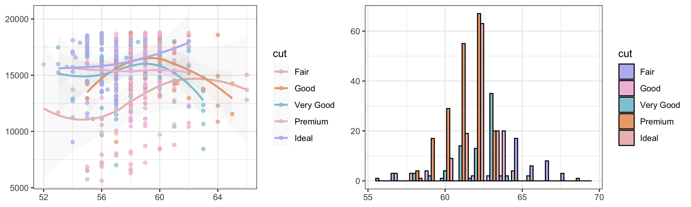
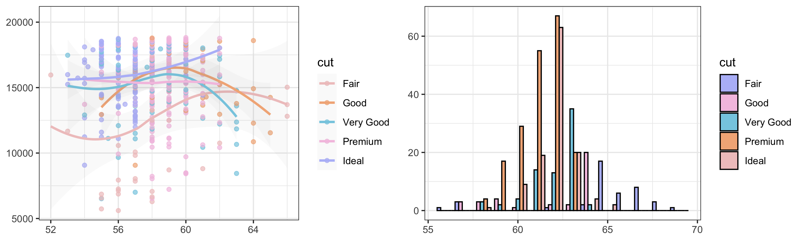

<h3 align="center">
<br/>

Catppuccin for
<a href="https://github.com/catppuccin/template">ggplot</a>

</h3>
<p align="center">
<a href="https://github.com/albert-ying/catppuccin/stargazers"></a>
<a href="https://github.com/albert-ying/catppuccin/issues"></a>
<a href="https://github.com/albert-ying/catppuccin/contributors"></a>
</p>
<p align="center">

</p>

## Previews

🌻 Latte</su

```
## `geom_smooth()` using formula 'y ~ x'
```



🪴 Frappé</su


```
## `geom_smooth()` using formula 'y ~ x'
```



🌺 Macchiato</su


```
## `geom_smooth()` using formula 'y ~ x'
```



🌿 Mochaary>

    ## `geom_smooth()` using formula 'y ~ x'


## Installation


    # install.packages("devtools")
    devtools::install_github("albert-ying/catppuccin")

## Usage

      library(ggplot2)
      library(catppuccin)

      ggplot(mtcars, aes(mpg, wt)) +
        geom_point(aes(colour = factor(cyl))) +
        scale_colour_catppuccin(palette = "latte") +
        theme_bw()


      ggplot(mtcars, aes(mpg, wt)) +
        geom_point(aes(colour = hp)) +
        scale_colour_catppuccin(palette = "frappe", discrete = FALSE) +
        theme_bw()

    ## Warning in scale_colour_catppuccin(palette = "frappe", discrete = FALSE): This
    ## palette has not been optimized for linear perception. Use at your own risk.


      ggplot(data = mpg) +
        geom_point(mapping = aes(x = displ, y = hwy, color = class)) +
        scale_colour_catppuccin(palette = "macchiato") +
        theme_bw()


      ggplot(diamonds) +
        geom_bar(aes(x = cut, fill = clarity)) +
        scale_fill_catppuccin() +
        theme_bw()


 

<p align="center">

</p>
<p align="center">
<a href="https://github.com/catppuccin/catppuccin/blob/main/LICENSE"></a>
</p>
